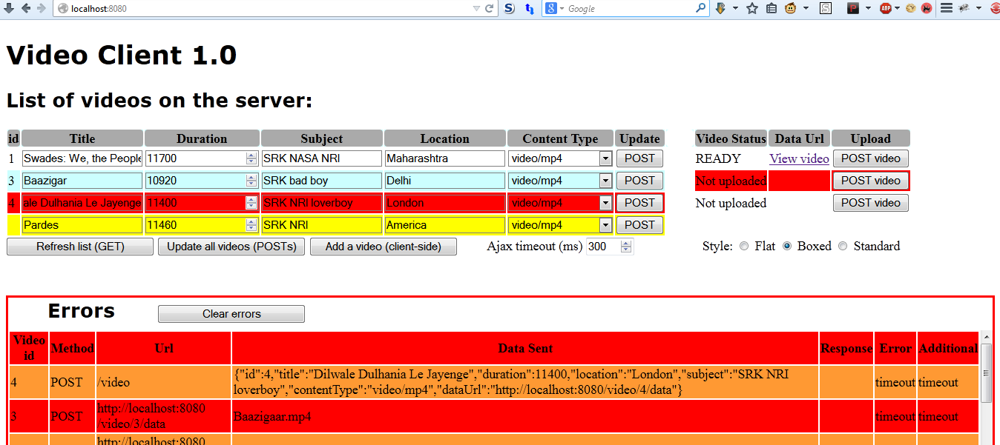

Video Client
=============
copyright &copy; 2014 TP Diffenbach

Extra for Coursera's mobilecloud-14 course, an HTML and javscript Single Page Application for exercising 
Assignment 1.

Because of single-origin policies implemented by browsers, index.html must be served by your Asgn1-VideoUp application.
 
Create a directory named static in the mobilecloud-14\assignments\Asgn1-VideoUp directory.
Place index.html into it.
Navigate your browser to http://localhost:8080 (or at whatever port you're running your assignment code).
You now have a javascript client that you can use to exercise/test your assignment code!

